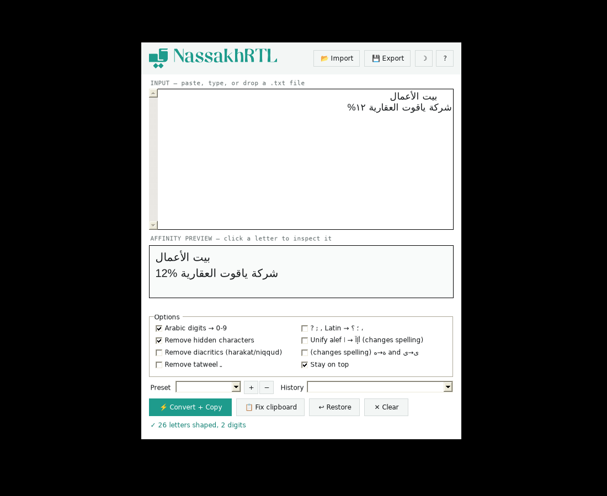
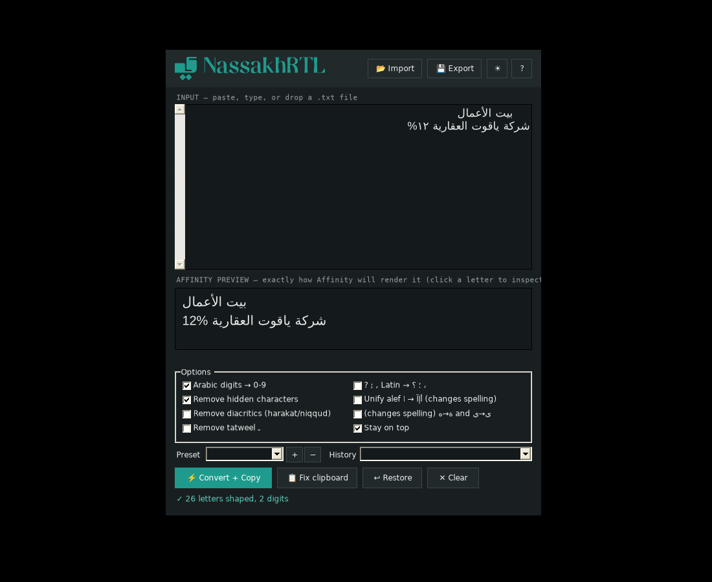

<div align="center">


**Fix Arabic, Hebrew, Persian, and Urdu text for Affinity apps — instantly.**

[](https://github.com/talhabinmunir/nassakhrtl/releases)
[](https://github.com/talhabinmunir/nassakhrtl/releases)
[](LICENSE)
[](mailto:tlhmunir@gmail.com)

</div>

---

## The problem

Affinity Designer, Affinity Publisher, and Affinity Photo have no Arabic shaping engine and no bidi support. When you paste Arabic, Persian, Urdu, or Hebrew text, you get this:

```
لامعأ تيب
```

Instead of this:

```
بيت الأعمال
```

Letters appear disconnected, isolated, and in the wrong order. NassakhRTL fixes that before you paste.

---

## How it works

NassakhRTL converts each letter to its correct contextual glyph form (initial, medial, final, or isolated), applies lam-alef ligatures, then reverses each line into visual order — which is what a left-to-right renderer like Affinity expects. The result pastes in and renders correctly.

---

## Quick start

**Option A — hotkey (fastest)**

1. Keep NassakhRTL running in the background.
2. Copy any RTL text from anywhere.
3. Press **Ctrl + Alt + R**.
4. Paste into Affinity with **Ctrl + V**.

**Option B — via the app window**

1. Paste or type text into the input box.
2. Check the Affinity Preview panel to confirm it looks right.
3. Click **Convert + Copy**.
4. Paste into Affinity.

---

## Download & run

No installation. No Python. No .NET SDK. Runs on any Windows 10 or 11 machine.

1. Go to [Releases](https://github.com/talhabinmunir/nassakhrtl/releases/latest)
2. Download `NassakhRTL.bat` and `NassakhRTL.ps1` — keep them in the same folder
3. Double-click `NassakhRTL.bat`

If Windows shows a blue SmartScreen warning, click **More info → Run anyway**. This appears because the file is new and unsigned. The source is fully readable in `NassakhRTL.ps1`.

> **Tip:** Put a shortcut to `NassakhRTL.bat` in your Windows Startup folder
> (`Win + R` → `shell:startup`) so it opens automatically.

---

## Features

| Feature | Details |
|---|---|
| **Arabic shaping** | Contextual letter forms + lam-alef ligatures |
| **Visual reorder** | Lines reversed for LTR renderers; Latin runs stay in place |
| **Affinity preview** | Live preview exactly matching Affinity rendering |
| **Character inspector** | Click any glyph → Unicode codepoint, name, and origin |
| **Arabic digits → 0-9** | ٠١٢٣٤٥٦٧٨٩ converted on the fly |
| **Remove diacritics** | Optional: strips harakat (Arabic) and niqqud (Hebrew) |
| **Remove tatweel** | Optional: removes ـ elongation marks |
| **Arabic → Latin punctuation** | ، ؛ ؟ → , ; ? |
| **Alef unification** | أ إ آ → ا (off by default, changes spelling) |
| **Hidden char removal** | Strips ZWSP, BOM, direction marks |
| **Drag and drop** | Drop a .txt file directly onto the app |
| **Import / Export** | .txt and .json (original + converted, with metadata) |
| **Presets** | Save named option sets per client or language |
| **History** | Last 10 conversions, one click to restore |
| **Dark / Light theme** | Persistent across sessions |
| **Settings persistence** | Window position, options, presets saved automatically |
| **Global hotkey** | Ctrl + Alt + R from any open application |
| **Keyboard shortcuts** | Ctrl + Enter to convert, Ctrl + Shift + V to paste-and-fix |
| **Languages** | Arabic, Persian, Urdu, Hebrew |
| **Privacy** | Fully offline, zero telemetry, no network calls |

---

## Supported languages

| Language | Script | Notes |
|---|---|---|
| Arabic | Arabic | Full shaping + ligatures |
| Persian / Farsi | Perso-Arabic | Additional letters: پ چ ژ گ |
| Urdu | Nastaliq subset | Additional letters: ٹ ڈ ڑ ں ھ ہ ی ے |
| Hebrew | Hebrew | Reversal only (Hebrew is already Unicode-encoded correctly) |

---

## Screenshots

<details>
<summary>Light theme</summary>



</details>

<details>
<summary>Dark theme</summary>



</details>

---

## Requirements

- Windows 10 or Windows 11
- PowerShell 5.1 (built into Windows, no download needed)
- Arial font (installed on every Windows machine by default)

---

## Files in this repo

```
NassakhRTL.bat       ← double-click to launch
NassakhRTL.ps1       ← full source (C# embedded in PowerShell)
assets/
  NassakhRTL-icon.svg
  NassakhRTL-logo.svg
  screenshot-light.png
  screenshot-dark.png
README.md
INSTRUCTIONS.md
CHANGELOG.md
CONTRIBUTING.md
LICENSE
```

---

## Author

**Talha bin Munir**
tlhmunir@gmail.com
[github.com/talhabinmunir](https://github.com/talhabinmunir)

---

## License

MIT — free to use, modify, and distribute. See [LICENSE](LICENSE).
