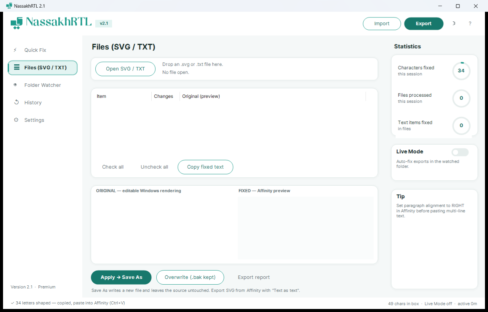
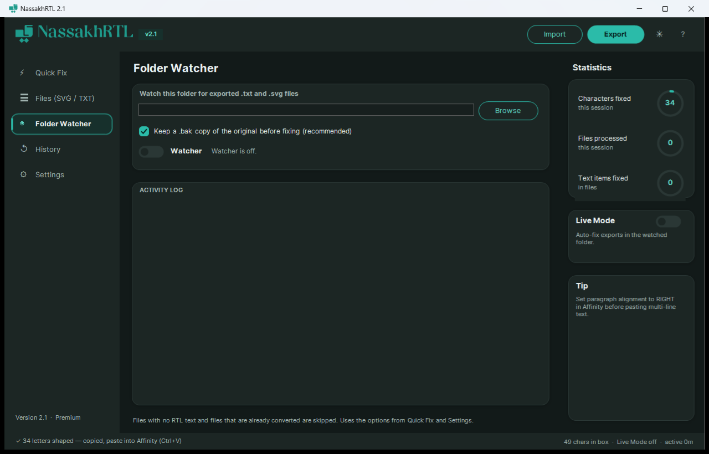

<div align="center">


**Fix Arabic, Hebrew, Persian, and Urdu text for Affinity apps — instantly.**

[](https://github.com/talhabinmunir/nassakhrtl/releases/latest)
[](https://github.com/talhabinmunir/nassakhrtl/releases)
[](https://github.com/talhabinmunir/nassakhrtl/releases/latest)
[](https://1712812868996.gumroad.com/l/nassakhrtl)
[](LICENSE)
[](mailto:tlhmunir@gmail.com)

</div>

---

## The problem

Affinity Designer, Affinity Publisher, and Affinity Photo have no Arabic shaping engine and no bidi support. When you paste Arabic, Persian, Urdu, or Hebrew text, you get this:

```
لامعأ تيب
```

Instead of this:

```
بيت الأعمال
```

Letters appear disconnected, isolated, and in the wrong order. NassakhRTL fixes that before you paste.

---

## What is new in v2.1

A full interface rebuild. The three tabs are now a three-column dashboard: sidebar
navigation on the left, the working area in the middle, and live session statistics
on the right.

- **Sidebar navigation** — Quick Fix, Files, Folder Watcher, History, Settings
- **History page** — the last 10 conversions, with original/converted previews and
  one click to send any of them back to Quick Fix
- **Settings page** — cleanup and normalisation options, presets, and the theme
  toggle, moved out of the cramped inline options box
- **Statistics panel** — characters fixed, files processed and text items fixed this
  session, plus a Live Mode toggle mirroring the folder watcher
- **Status bar** — last action, character count, and watcher mode at a glance

Everything from v1 and v2.0 still works exactly as before: the same conversion
engine, the same hotkeys, the same file and watcher behaviour.

---

## What is new in v2.0

### Fix text directly inside Affinity — no copy-paste

**Type in Affinity → press one key → done.**

| Hotkey | What it does |
|---|---|
| **Ctrl + Alt + F** | Fix the text box you are currently in inside Affinity |
| **Ctrl + Alt + Z** | Restore a converted text box back to editable text |
| **Ctrl + Alt + R** | Fix whatever is in the clipboard (v1 behaviour) |

NassakhRTL selects the box content, converts it, and pastes it back automatically. Your previous clipboard is preserved. If the box has no RTL text, is already converted, or the selection fails — nothing is changed.

### SVG / TXT File Editor

Open an SVG or TXT file exported from Affinity. Every RTL text item is listed with its element name and change count. Preview original vs fixed side by side. Approve individual items or all at once. Save As a new file, or overwrite with an automatic `.bak` backup. Export a fix report for client sign-off.

### Folder Watcher

Point NassakhRTL at your project folder. Any `.txt` or `.svg` file you export from Affinity is fixed automatically in the background — with a `.bak` of the original kept and a tray notification confirming the fix.

### System tray

Minimize to tray. NassakhRTL sits quietly in the background while you work. Fix clipboard or toggle the watcher from the tray menu without opening the window.

---

## Quick start

**The fastest workflow (v2):**
1. Run NassakhRTL (minimized to tray is fine).
2. In Affinity, double-click a text frame to enter text editing mode.
3. Type or paste your Arabic/Urdu/Hebrew text.
4. Press **Ctrl + Alt + F**.
5. Text is fixed in place. Paste into any other Affinity frame with Ctrl + V if needed.

**Classic clipboard workflow (v1, still works):**
1. Copy RTL text from anywhere.
2. Press **Ctrl + Alt + R**.
3. Paste into Affinity with Ctrl + V.

---

## Download

Single `.exe` — double-click and go. No installation, no Python, no .NET SDK.

**GitHub Releases (recommended):**
[https://github.com/talhabinmunir/nassakhrtl/releases/latest](https://github.com/talhabinmunir/nassakhrtl/releases/latest)

**Gumroad (free / pay what you want):**
[https://1712812868996.gumroad.com/l/nassakhrtl](https://1712812868996.gumroad.com/l/nassakhrtl)

> **SmartScreen warning:** Windows may show "Windows protected your PC" because the
> file is new and unsigned. Click **More info → Run anyway**. The full source code
> is readable in `NassakhRTL.ps1`.

> **Tip:** Put a shortcut to `NassakhRTL.exe` in your Windows Startup folder
> (`Win + R` → `shell:startup`) so it is always running when you open Affinity.

---

## Features

| Feature | Details |
|---|---|
| **Ctrl+Alt+F in-Affinity fix** | Fixes the active Affinity text box in place — no copy-paste needed |
| **Ctrl+Alt+Z restore** | Restores a converted box to editable logical text |
| **Arabic shaping** | Contextual letter forms + lam-alef ligatures |
| **Visual reorder** | Lines reversed for LTR renderers; Latin runs stay in place |
| **Affinity preview** | Live preview exactly matching Affinity rendering |
| **Character inspector** | Click any glyph → Unicode codepoint, name, and origin |
| **SVG / TXT File Editor** | Open exported files, review diffs, apply per item, Save As or Overwrite with .bak |
| **Fix report export** | Save a .txt record of every change for client sign-off |
| **Folder Watcher** | Auto-fixes exported files; .bak always kept; tray notifications |
| **System tray** | Minimize to tray, quick menu, balloon notifications |
| **Arabic digits → 0-9** | ٠١٢٣٤٥٦٧٨٩ converted on the fly |
| **Remove diacritics** | Optional: strips harakat (Arabic) and niqqud (Hebrew) |
| **Remove tatweel** | Optional: removes ـ elongation marks |
| **Arabic → Latin punctuation** | ، ؛ ؟ → , ; ? |
| **Alef unification** | أ إ آ → ا (off by default, changes spelling) |
| **Hidden char removal** | Strips ZWSP, BOM, direction marks |
| **Drag and drop** | Drop .txt or .svg files directly onto the app |
| **Import / Export** | .txt and .json (original + converted, with metadata) |
| **Presets** | Save named option sets per client or language |
| **History** | Last 10 conversions, one click to restore |
| **Dark / Light theme** | Persistent across sessions |
| **Settings persistence** | Window, options, presets, watcher folder saved automatically |
| **Languages** | Arabic, Persian, Urdu, Hebrew |
| **Privacy** | Fully offline, zero telemetry, no network calls |

---

## Supported languages

| Language | Script | Notes |
|---|---|---|
| Arabic | Arabic | Full shaping + ligatures |
| Persian / Farsi | Perso-Arabic | Additional letters: پ چ ژ گ |
| Urdu | Nastaliq subset | Additional letters: ٹ ڈ ڑ ں ھ ہ ی ے |
| Hebrew | Hebrew | Reversal only (Unicode-encoded correctly already) |

---

## Screenshots

<details open>
<summary>Quick Fix — light theme</summary>


</details>

<details>
<summary>Files (SVG / TXT) — file editor</summary>



</details>

<details>
<summary>Folder Watcher — dark theme</summary>



</details>

<details>
<summary>Dark theme</summary>


</details>

---

## Requirements

- Windows 10 or Windows 11
- No installation needed
- Arial font (on every Windows machine by default)

---

## Files in this repo

```
NassakhRTL.exe       <- download and run (single file)
NassakhRTL.ps1       <- full source code
NassakhRTL.bat       <- alternative launcher (runs .ps1 directly)
NassakhRTL.ico       <- app icon
assets/
  NassakhRTL-icon.svg
  NassakhRTL-logo.svg
  screenshot-light.png
  screenshot-files.png
  screenshot-watcher.png
README.md
INSTRUCTIONS.md
CHANGELOG.md
CONTRIBUTING.md
LICENSE
```

---

## Build from source

```powershell
# Install ps2exe (one time)
Install-Module -Name ps2exe -Scope CurrentUser -Force

# Build
Invoke-ps2exe -InputFile .\NassakhRTL.ps1 -OutputFile .\NassakhRTL.exe `
  -IconFile .\NassakhRTL.ico -NoConsole -STA `
  -title "NassakhRTL" -product "NassakhRTL" `
  -description "RTL Text Fixer for Affinity" `
  -company "Talha bin Munir" -version "2.1.0.0"
```

---

## Why not native .afdesign editing?

The `.afdesign` format has no public specification. Writing bytes back into it
without a spec risks corrupting client files. The safe round-trip is:
**Affinity → Export SVG (Text as text) → fix in NassakhRTL → open fixed SVG in Affinity.**
Native .afdesign support will be added if Serif publishes a file format specification.

---

## Author

**Talha bin Munir**
tlhmunir@gmail.com
[github.com/talhabinmunir](https://github.com/talhabinmunir)
[youtube.com/@Talhabinmuneer](https://www.youtube.com/@Talhabinmuneer)

---

## License

MIT — free to use, modify, and distribute. See [LICENSE](LICENSE).
